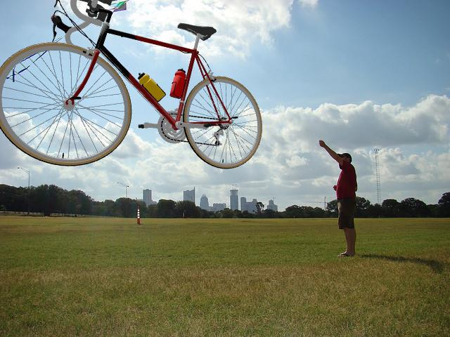

# HackOS-Bicycle-Classification

This project implements a Vision Transformer (ViT) model fine-tuned from `google/vit-base-patch16-224-in21k` to classify images based on the presence of bicycles. The model was trained on a modified COCO dataset containing 25,000 images, with half featuring bicycles and the other half without.

Due to the original [COCO 2017](https://cocodataset.org/#download) dataset containing only about 3,000 images with bicycles, we utilized a data augmentation script to enhance our dataset. This script employs 3D renders of bicycles in various positions, angles, and sizes, blending them into relevant images from the COCO dataset that do not already include bicycles. This approach led to an impressive accuracy of 95.62% in [betamark](https://github.com/exobyte-labs/betamark) after 4 epochs of training.

## Training
To train the model, follow these steps:
1. Download the images and annotations for [COCO 2017](https://cocodataset.org/#download).
2. Generate the augmented dataset using `generate.py`.
3. Train the model by executing the Jupyter Notebook `Train.ipynb`.
4. Benchmark the model's performance by running `benchmark.py`.

## TODO
- Improve the background selection criteria for generating new bicycle frames
- Enhance the positioning of bicycles during frame generation
- Implement multi-threading to accelerate the generation of new bicycle frames
- Generate new negative frames featuring motorcycles, scooters, etc., to help the model better differentiate bicycles from similar vehicles
